# dasSpiel

**Wir machen das Spiel des Übermenschen**

## Koncept

Et 2-dimensionelt overlevelsesspil, hvor burgeren kan udforske verdenen omkring sig, og verden genererer omkring spilleren. Verdenen genereres ud fra et seed, som er et tal. Dette tillader generatoren at generere to identiske verdener, skulle det samme seed angives til spillet.

## Inspirationsmateriale

Hollow knight (Den har intet at gøre med spillet, men den fortjener det)
2d minecraft
Top down Terraria
Don’t starve together
Don’t starve together
Legend of Zelda – A link between worlds

## Roller

| Aske | Louis | Jacob |
| ---- | ----- | ----- |
| S.M. |       |       |

## How to run
For at køre programmet kan exe filen main.exe fra dist folderen køres.
Alternativt kan programmet køres med python interpreteren enten ved at køre main.py fra ens IDE eller med `python main.py` i kommandolinjen. For denne metode sørg for at have alle biblioteker installeret. Disse findes i requirements.txt og kan installeres med kommandoen `pip install -r requirements.txt`

## FLOWCHARTS OG KLASSEDIAGRAMMER

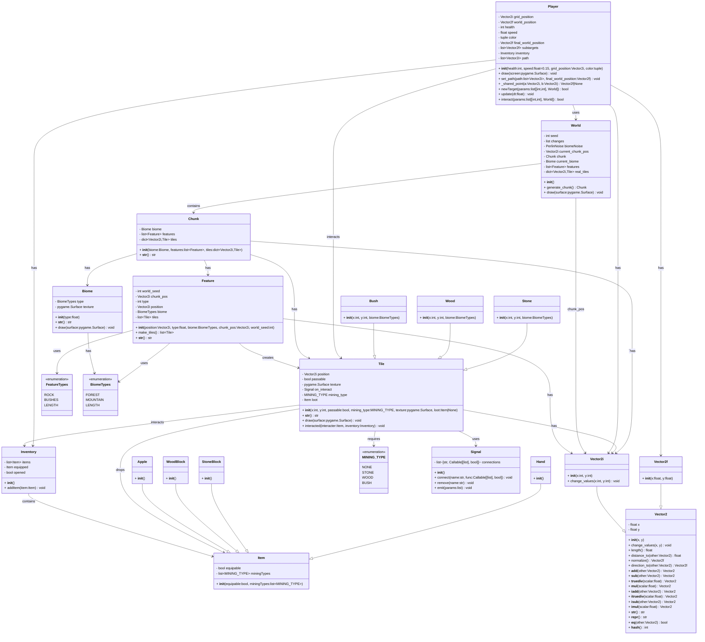

### Main

```mermaid
flowchart TD
    A["main()"] --> B["pygame.init()
    screen = pygame.display.set_mode(...)
    pygame.display.set_caption(...)
    world = World()
    player = Player(health=10)
    leftClick = Signal()
    rightClick = Signal()"]

    B --> C["leftClick.connect('move player', player.newTarget)
    
    rightClick.connect('interact', player.interact)"]

    C --> D["running = True
    clock = pygame.time.Clock()
    dt = 0"]

    D --> E["for event in pygame.event.get()"]
    E --> F{"event.type == QUIT"}
    F -- Yes --> G["running = False"]
    F -- No --> H["continue"]

    G --> I["player.update(dt)
    screen.fill((0,0,0))
    world.draw(screen)
    player.draw(screen)
    pygame.display.flip()
    dt = clock.tick(1)"]
    H --> I

    I --> J{"while running"}
    J -- True --> J1{if main_menu == True}
    J1 -- True --> J2[world.draw(screen)
    player.draw(screen)
    paused_text.draw(screen)
    esc_menu(quit_menu, screen)
    continue]
    J2 --> J1
    J1 -- False --> K["for event in pygame.event.get()"]
    K --> L{"event.type == QUIT"}
    L -- Yes --> M["running = False"]
    L -- No --> N{"event.type == MOUSEBUTTONDOWN"}
    N -- Yes --> O{"event.button == LEFT or RIGHT"}

    O -- LEFT --> P["leftClick.emit([event.pos, world])
    print('l')"]
    O -- RIGHT --> Q["print('r')
    rightClick.emit([event.pos, world])"]
    O -- No --> K

    P --> R["player.update(dt)
    screen.fill((0,0,0))
    world.draw(screen)
    player.draw(screen)
    pygame.display.flip()
    dt = clock.tick(60)"]
    Q --> R
    N -- No --> R
    R --> J

    %% End
    J -- False --> S["pygame.quit()"]
    S --> T["end main()"]

```

### Pathfind flowcharts
#### astar
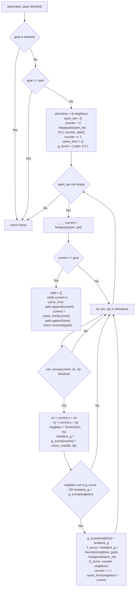

#### can_move
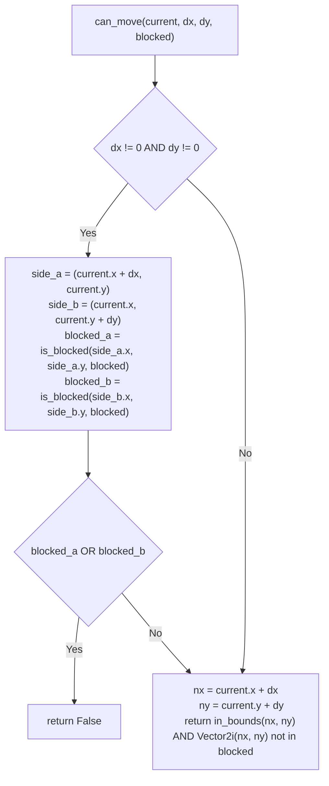

#### is_blocked
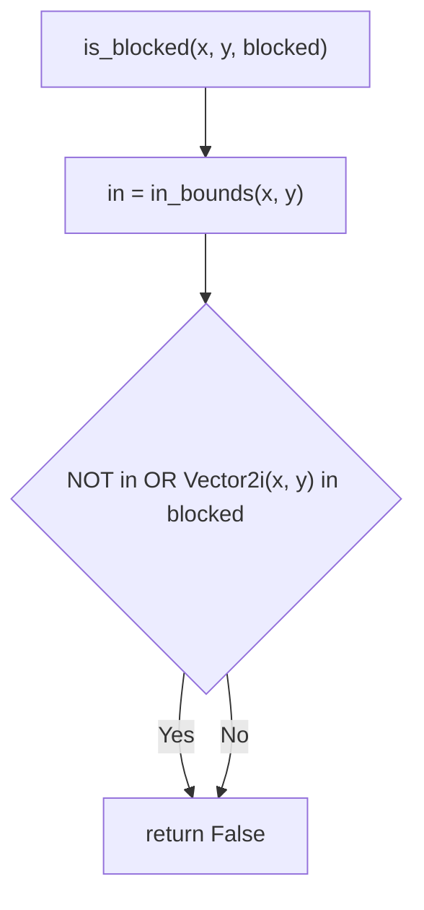

#### in_bounds
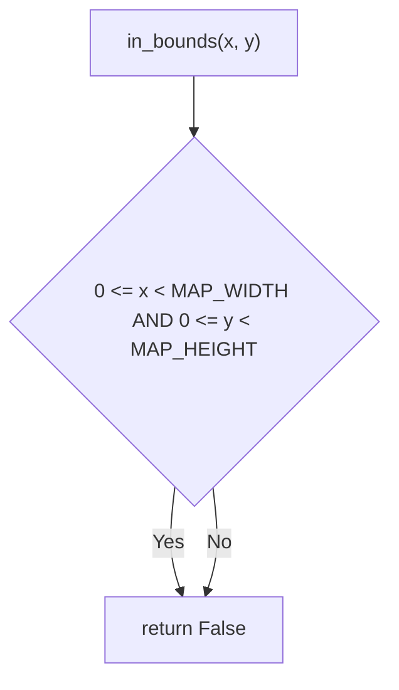

#### move_cost
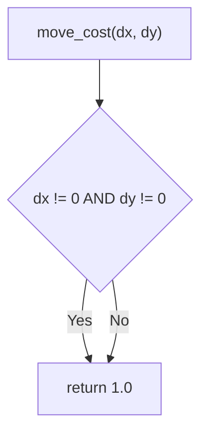
#### heuristic
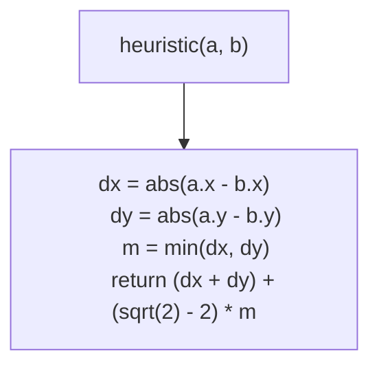

### Player flowcharts

#### set_path
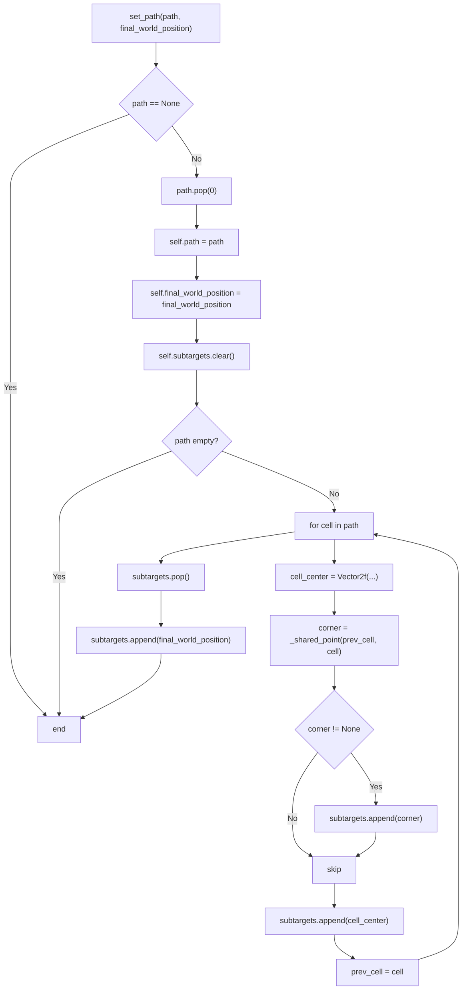

#### _shared_point
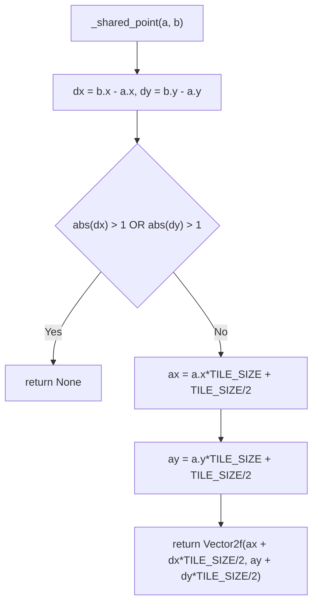

#### newTarget
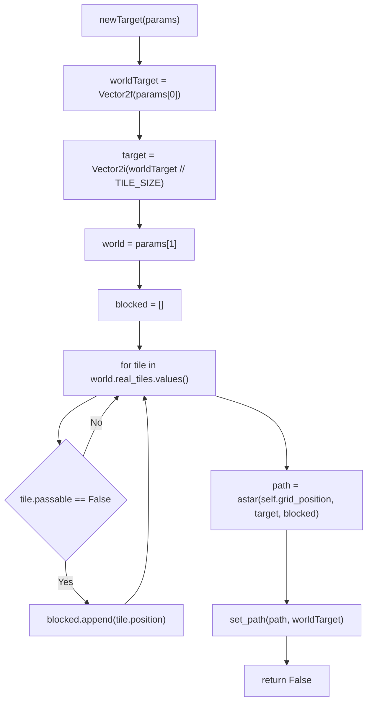

#### update
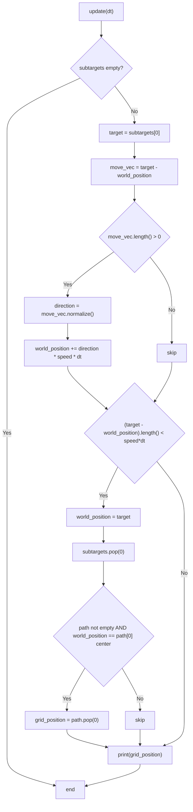

#### interact
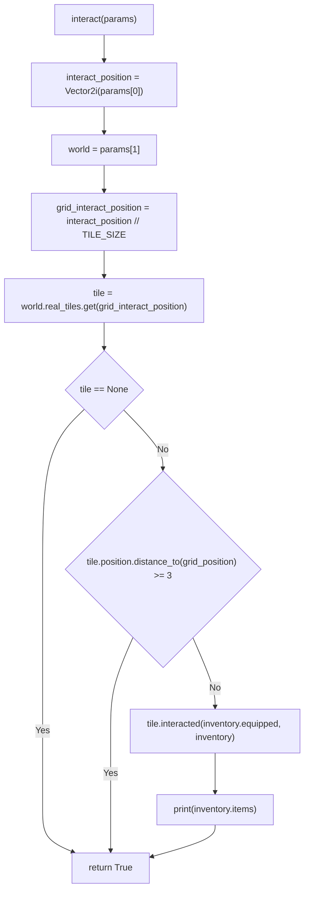

### World Flowcharts

#### generate_chunk
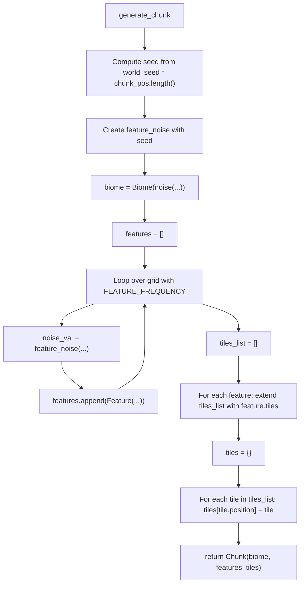

### Signal Flowcharts
#### emit
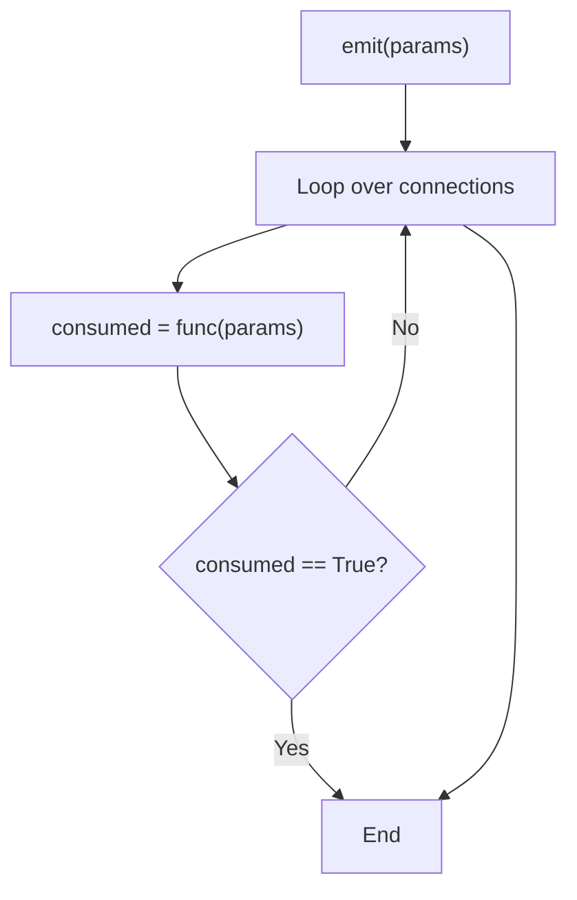


https://trello.com/b/TVuGyqtP
